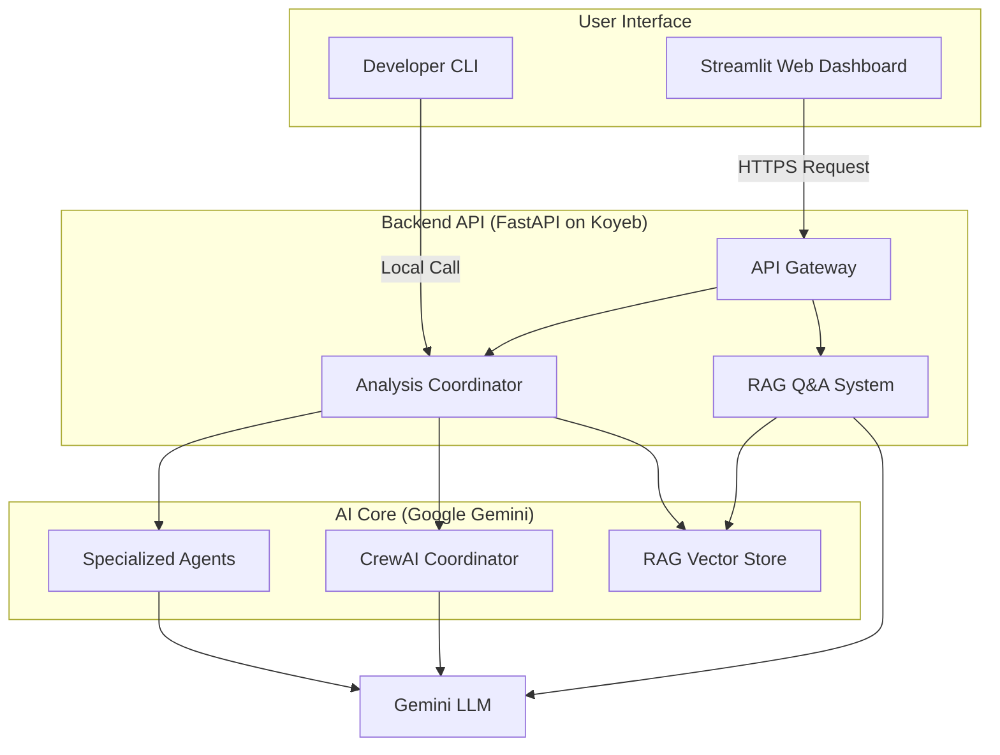

# CodeIQ: AI-Powered Code Quality Intelligence Agent


CodeIQ is an advanced, AI-powered agent designed to perform deep analysis of code repositories. It goes beyond simple linting to provide actionable, developer-friendly intelligence on security, performance, quality, and architecture, helping teams maintain high standards and manage technical debt at scale.

The project features a powerful local CLI for developers and a fully deployed web application for interactive, visual analysis.

**Live Demo:** [https://codequalityagent-633.streamlit.app/](https://codequalityagent-633.streamlit.app/)
![CodeIQ Dashboard]


** ![CodeIQ Backend] **


---

## ✨ Core Features

* **Multi-Faceted Analysis:** Detects a wide range of issues across several categories:
    * 🛡️ **Security Vulnerabilities:** Identifies common weaknesses (CWE) and potential risks.
    * ⚡ **Performance Bottlenecks:** Finds inefficient code, memory issues, and algorithmic complexity problems.
    * 🔧 **Code Quality (AST):** Uses Abstract Syntax Tree parsing for precise analysis of code structure, identifying issues like high complexity and poor error handling.
    * 🏗️ **Architectural Overview:** Generates high-level architecture diagrams automatically using Mermaid.js.
* **Multi-Language Support:** Natively analyzes Python, Java, and JavaScript/TypeScript codebases.
* **Interactive Web Dashboard:** A polished Streamlit frontend provides:
    * Visual scorecards and charts (Radar & Pie charts).
    * AI-generated executive summaries for high-level takeaways.
    * Detailed, prioritized lists of findings with AI-powered explanations and fix suggestions.
* **Conversational Q&A (RAG):**
    * **Report Summary Q&A:** Ask high-level questions about the analysis results.
    * **Ask the Codebase (RAG):** Ask deep, specific questions about the code's implementation, powered by a Retrieval-Augmented Generation backend.
* **Developer-Focused CLI:** A powerful command-line interface for local analysis, security scans, and performance checks.

---

## 🚀 Getting Started

### Local Development & CLI Usage

The entire application is containerized with Docker for easy and consistent setup.

**Prerequisites:**
* Docker Desktop installed and running.
* Git installed.
* A Google Gemini API Key.

**Setup:**

1.  **Clone the repository:**
    ```bash
    git clone [https://github.com/Virtuoso633/CodeQualityAgent.git](https://github.com/Virtuoso633/CodeQualityAgent.git)
    cd CodeQualityAgent
    ```

2.  **Configure your API Key:**
    * Make a copy of the `.env.example` file and rename it to `.env`.
    * Open the `.env` file and add your Google Gemini API key:
      ```
      GEMINI_API_KEY=your_gemini_api_key_here
      ```

3.  **Build and Run with Docker Compose:**
    ```bash
    docker-compose -f web/docker-compose.yml up --build
    ```
    This command builds both the backend and frontend containers (as defined in `web/docker-compose.yml`) and starts the application.

4.  **Access the Local App:**
    * **Frontend:** Open your browser to `http://localhost:8501`
    * **Backend API Docs:** `http://localhost:8000/docs`

**Using the CLI:**

You can run commands directly inside the running backend container.

1.  Open a new terminal window.
2.  Find the backend container ID: `docker ps`
3.  Access the container's shell: `docker exec -it <container_id> /bin/bash`
4.  Run analysis commands:
    ```bash
    # Run a simple analysis on a file
    python -m cli.main analyze ./test_code/example.py

    # Run a specialized security scan
    python -m cli.main security ./test_code/example3.py

    # View all available commands
    python -m cli.main --help
    ```

---

## 📖 Frontend Interface Guide

The web dashboard is designed to be intuitive and powerful, providing a complete workflow for code analysis.

### Start New Analysis (Sidebar)

This is the control panel for your agent.
* **GitHub Repository:** Enter a public URL to a GitHub repo (e.g., `https://github.com/user/repo`). The backend will clone it and run the full analysis.
* **Upload Project Files:** Use the file uploader to select multiple files (or a `.zip` archive) directly from your computer. The backend will analyze this uploaded bundle.

### Analysis Dashboard (Main Tab)

Once an analysis is complete, this tab becomes your main view.
* **Executive Summary:** An AI-generated (via CrewAI) high-level summary of the project's health, perfect for a quick overview.
* **Score Cards:** At-a-glance metric scores (out of 10) for **Overall**, **Security**, **Performance**, **Maintainability**, and **Documentation**.
* **Visualizations:**
    * **Score Breakdown (Radar Chart):** Quickly see the project's strengths and weaknesses in one visual.
    * **Language Distribution (Pie Chart):** Understand the tech stack composition of the repository.
* **Detailed Findings (Tabs):** Drill down into specific issues.
    * **🛡️ Security:** A prioritized list of vulnerabilities, with AI explanations and fix suggestions.
    * **⚡ Performance:** A prioritized list of bottlenecks.
    * **🔧 Quality (AST):** Issues found via direct AST parsing, like high complexity.
    * **🏗️ Architecture:** An AI-generated Mermaid diagram of the project structure, with a link to a live editor.
    * **🔬 Testing Gaps:** A list of functions and logic paths that appear to be missing test coverage.

### Chat (Main Tab)

This tab activates after an analysis is complete, allowing you to "talk" to your codebase.
* **Report Summary Q&A:** Ask high-level questions about the *generated report* (e.g., "What's the most critical security issue?" or "Summarize the performance problems").
* **Ask the Codebase (RAG):** Ask specific, deep questions about the *code's implementation* (e.g., "How does the `user_auth` function handle password hashing?" or "Where is the database connection configured?"). This uses the RAG index for grounded, in-code answers.

---

## 🏛️ Architecture & Design

CodeIQ is built on a modern, decoupled client-server architecture, containerized for portability.

### High-Level Diagram


---

## Major Design Decisions & Trade-offs

1.  **Decoupled Frontend/Backend:**

      * **Decision:** The Streamlit frontend is completely separate from the FastAPI backend.
      * **Reasoning:** This is a robust, scalable pattern. It allows the frontend and backend to be developed, deployed, and scaled independently. The backend is a stateless API, while the frontend handles all user session state.
      * **Trade-off:** This adds a small amount of network latency and complexity (like CORS) compared to a monolithic app, but the scalability and separation of concerns are well worth it.

2.  **Agentic, Multi-Layered AI Analysis:**

      * **Decision:** Instead of a single large prompt, the analysis is handled by a hierarchy of specialized AI agents (Security, Performance, Architecture) and a coordinating supervisor agent (CrewAI).
      * **Reasoning:** This "separation of concerns" for the AI leads to much higher quality results. Each agent has a specific, focused prompt and task, preventing the "jack-of-all-trades, master-of-none" problem common with large, generic prompts.
      * **Trade-off:** This approach is slightly slower and more complex to orchestrate than a single AI call, but the depth and accuracy of the analysis are significantly better.

3.  **Retrieval-Augmented Generation (RAG) for Q\&A:**

      * **Decision:** For the "Ask the Codebase" feature, we implemented a full RAG pipeline. The backend builds a FAISS vector index of the codebase's AST and source code during analysis.
      * **Reasoning:** This is a "Super Stretch" feature that solves the context window limitation of LLMs. It allows the AI to answer questions about codebases that are far too large to fit into a single prompt, providing answers that are grounded in the actual source code.
      * **Trade-off:** This adds overhead to the initial analysis (building the index) and requires more complex backend logic, but it's the only way to enable a truly intelligent and deep Q\&A experience.

4.  **Decoupled Cloud Deployment (Koyeb + Streamlit Cloud):**

      * **Decision:** The FastAPI backend is deployed as a Docker container on Koyeb, and the Streamlit frontend is deployed on Streamlit Community Cloud.
      * **Reasoning:** This leverages the best-in-class, free-tier-friendly platform for each service. Koyeb is excellent for containerized backends (like our Docker/Gunicorn app), while Streamlit Cloud is purpose-built for Streamlit frontends and handles all the scaling and WebSocket complexity automatically.
      * **Key Challenge:** This "cross-origin" architecture creates a security requirement. The backend *must* explicitly grant permission to the frontend's domain. This was solved by implementing a **CORS (Cross-Origin Resource Sharing)** middleware in FastAPI to allow requests from the Streamlit app's URL.

### Technical Notes & Key Libraries

  * **Backend:** FastAPI, Uvicorn, Gunicorn
  * **Frontend:** Streamlit
  * **AI Orchestration:** LangChain, CrewAI
  * **LLM Provider:** Google Gemini (Flash & Pro models via LiteLLM)
  * **RAG:** FAISS (Vector Store), LangChain for embedding and retrieval
  * **Code Parsing:** `tree-sitter` for robust, multi-language AST parsing.
  * **Deployment:** Docker, Koyeb (Backend), Streamlit Community Cloud (Frontend)

